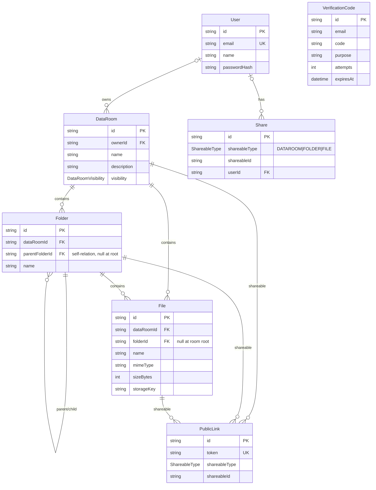

# Acme Data Room

Full-stack Data Room MVP — a take-home project for Acme Corp.'s virtual due diligence.
An organized, secure repository for storing and distributing documents, inspired by
Google Drive / Dropbox / Box (the Data Room is the top-level folder).

Full task text: [TASK.md](../TASK.md)

## Highlights

- **Real backend, real database, working end to end.** NestJS + Prisma + PostgreSQL +
  S3-compatible object storage. Files are uploaded over `multipart/form-data` with real
  per-file progress (XHR) and downloaded via presigned GET URLs — the API never streams
  file bytes back.
- **Email-OTP auth.** Email/password plus a 6-digit verification code for registration,
  login, password reset, and account deletion. Sessions are a httpOnly, `SameSite=Lax`
  JWT cookie (`access_token`, 7-day expiry). Codes are emailed via Gmail OAuth and are
  rate-limited, expiry-limited (10 min), and attempt-limited (5).
- **Validated API.** Global `ValidationPipe` + `class-validator` DTOs return 400 on bad
  input, never a 500 crash; `/api/auth/*` is rate-limited (100 req/60 s per IP).
- **External APIs behind interfaces.** `integrations/` wraps S3 (`FILE_STORAGE`) and Gmail
  send (`EMAIL_SERVICE`) so services are provider-agnostic and unit-testable.
- **No existence leak.** Unauthorized reads/writes return 404, never 403; wrong
  credentials return 401.
- **Read-only sharing, both modes.** Per-user `Share` (owner grants specific users) and
  token-based `PublicLink` (anyone with the link), revocable, with read-only enforcement
  in `AccessService`.

## Stack

| Layer      | Tech                                                              |
| ---------- | ----------------------------------------------------------------- |
| Frontend   | React 18 + TypeScript + Vite + Tailwind + shadcn-style components |
| Backend    | NestJS 10 + Prisma + PostgreSQL                                   |
| File store | S3-compatible object storage (MinIO locally, Backblaze B2 in prod)|
| Auth       | Email/password + 6-digit email OTP; httpOnly JWT cookie           |
| Integrations | `integrations/s3-storage.ts`, `integrations/gmail-email.service.ts` |

## Features

Everything in the task's functional requirements is implemented:

- **Folders** — create (nested to any depth), browse with breadcrumb navigation, rename,
  move (guards against moving a folder into itself or its own descendant), delete a
  folder and its whole subtree (UI warns with the affected folder/file counts).
- **Files** — multi-file upload with drag-and-drop and per-file progress bars, view a file
  in the UI (preview modal), rename, move to another folder, delete. Same-name uploads,
  renames, and moves get an auto-suffix (`report (1).pdf`) — no data loss, no crash.
- **Sharing** — share a Data Room, a folder, or a single file; the recipient gets read-only
  access including nested content. Two modes: a public link (token, anyone with the link;
  requires the room to be `PUBLIC`) and a permissioned share (only granted users). The
  owner can revoke either at any time.
- **Search** — case-insensitive search across folder and file names within a Data Room.
- **Room presence** — who is currently viewing a room (in-memory, 5-min TTL).
- **Data Rooms** — create/rename/delete your own rooms, view rooms shared with you,
  private-vs-public visibility.

## Project layout

```
acme-data-room/
├── client/            # React frontend (Vite + Tailwind + shadcn-style components)
│   └── src/components/blocks/  # Auth, Dashboard, RoomViewer, ShareDialog,
│                               # PublicViewer, FileViewer, Profile, ...
├── server/            # NestJS backend (REST API, Prisma, S3 uploads)
│   ├── routes/        # @Controller HTTP adapters + DTO validation
│   ├── controller/    # request handling → services
│   ├── services/      # business logic (auth, rooms, folders, files, shares,
│   │                  #   public links, access, presence, verification)
│   ├── repository/    # data access (Prisma)
│   ├── integrations/  # external API adapters (S3 storage, Gmail email)
│   ├── middleware/    # AuthGuard, RateLimitMiddleware, request logging
│   ├── dto/           # class-validator DTOs
│   ├── interfaces/    # response/entity TS types
│   ├── prisma/        # schema + migrations
│   └── tests/         # server tests + TESTS.md (every test described)
└── infra/
    └── CREDENTIALS.md # where to obtain every credential, current status
```

## Local development

Requirements: Node 20+, Docker, npm.

```bash
# 1. Start Postgres and MinIO (adjust the ports to match server/.env)
docker run -d --name acme-dataroom-postgres \
  -e POSTGRES_USER=dataroom -e POSTGRES_PASSWORD=dataroom -e POSTGRES_DB=dataroom \
  -p 5432:5432 postgres:16-alpine

docker run -d --name acme-dataroom-minio \
  -e MINIO_ROOT_USER=minioadmin -e MINIO_ROOT_PASSWORD=minioadmin \
  -p 9000:9000 -p 9001:9001 \
  minio/minio server /data --console-address ":9001"

# 2. Create the S3 bucket (console: http://localhost:9001, minioadmin/minioadmin)
docker exec acme-dataroom-minio sh -c \
  'mkdir -p /data/acme-dataroom'

# 3. Env files
cp .env.example .env
cp .env.example server/.env    # API reads DATABASE_URL, S3_*, JWT_SECRET, GMAIL_*

# 4. Install + migrate
cd server && npm install
npx prisma migrate dev

# 5. Run the API
npm run start:dev
#   API  → http://localhost:4000
#   MinIO console → http://localhost:9001 (minioadmin / minioadmin)

# 6. Server tests (build + reset test DB + boot compiled server + HTTP tests)
cd server && npm test
```

> Email OTP: set `GMAIL_REFRESH_TOKEN`, `GMAIL_FROM`, and `GMAIL_REDIRECT_URI` to actually
> send codes (see `infra/CREDENTIALS.md`). When email is not configured, `issueCode`
> returns `sent: false` and the code is included in the API response, so local flows work
> out of the box.

Every server test is documented in `server/tests/TESTS.md` — what it does, what it verifies,
and the expected error/response shape. The suite covers auth, data rooms, folders, files,
shares, and public links, including read-only enforcement for share recipients.

## Design decisions

- **Layered architecture.** `routes/` (HTTP + DTO validation) → `controller/` →
  `services/` (business logic) → `repository/` (Prisma) → PostgreSQL. External APIs live
  in `integrations/` behind interfaces (`FILE_STORAGE`, `EMAIL_SERVICE`) so services never
  call providers directly.
- **Request validation.** Global `ValidationPipe` + `class-validator` DTOs (`server/dto/`) —
  invalid input returns 400, never a 500 crash. Auth routes are rate-limited
  (`RateLimitMiddleware`, 100 req/60 s per IP).
- **Upload/download.** Uploads are `multipart/form-data` (`POST /api/files`) with a MIME
  allow-list and `MAX_FILE_SIZE_BYTES` limit; the client reports real per-file progress via
  XHR. Downloads return a short-lived presigned GET URL, so file bytes never proxy through
  the API. Objects live at `rooms/{roomId}/{uuid}/{name}`.
- **Email-OTP auth.** Registration, login, password reset, and account deletion all require
  a 6-digit code from `VerificationCode` (10-min expiry, 5 attempts, 5 codes/hour/email).
  On success the API sets an httpOnly JWT cookie (`access_token`, 7 days, `SameSite=Lax`,
  `Secure` in prod). The client uses `credentials: 'include'`; `AuthGuard` accepts either
  the cookie or a `Bearer` header.
- **Name-conflict auto-suffix.** `utils/name-conflicts.ts` resolves collisions on upload,
  rename, and move (`report.pdf` → `report (1).pdf`). Uniqueness is enforced by
  `@@unique([dataRoomId, parentFolderId, name])` plus partial unique indexes for the root
  (null parent) case — see migrations `20260815132900_root_partial_unique`.
- **No existence leak.** Authenticated users with no access get 404, never 403; wrong
  credentials get 401. Write operations require ownership, so shared users are effectively
  read-only by construction.
- **Read-only sharing.** `AccessService.canRead` returns true for the owner or any user
  with a matching `Share` (exact item, ancestor folder, or the room); `PublicLink` is
  token-based, unauthenticated, and requires a `PUBLIC` room. Writes always go through
  owner-only checks.
- **Deletes clean up storage.** Deleting a room, folder, or file removes DB rows (FK
  `ON DELETE CASCADE`) and then deletes the backing S3 objects (failures are swallowed so a
  transient storage error never leaves a partial DB state); folder deletion returns the
  affected folder/file counts for the warning UI.
- **Presence.** In-memory last-seen map per room (`presence.service.ts`, 5-min TTL) drives
  the "who's viewing" UI; it's a single-instance optimization, not a persistence source.

## Data model / ERD

Prisma schema: [server/prisma/schema.prisma](./server/prisma/schema.prisma). Migrations in
`server/prisma/migrations/`.



Key indexes: `Folder` and `File` are indexed on `dataRoomId` and `parentFolderId`/`folderId`
(and unique per parent on `name`); `Share` is unique on `(shareableType, shareableId,
userId)`; `PublicLink.token` is unique; `User.email` is unique.

## How it scales

- **Folder subtree size/count.** Computed on the fly with a recursive CTE:
  `findSubtreeStats` walks `Folder.parentFolderId` from a root and returns
  `COUNT(*)` folders, `COUNT(*)` files, and `SUM(sizeBytes)` over files in the subtree;
  `findSubtreeStatsByRoots` batches the same query for a whole page of folders so listings
  don't do one query per card. The schema is already ready for the denormalized upgrade:
  maintain `Folder.sizeBytes`/`itemCount` transactionally on every write, and use the CTE
  as an audit/self-heal fallback.
- **100,000 files in one room.** Listing already goes through indexed, bounded pages
  (offset/limit, default 50 / max 100) on `(dataRoomId, parentFolderId)`. For 100k files:
  (1) move to keyset/cursor pagination so offsets never degrade with depth — the page
  queries already use the right composite indexes; (2) keep room/folder totals and subtree
  aggregates denormalized instead of counting per request; (3) switch name search from
  `LIKE` to a trigram index (`pg_trgm`) or full-text search. Access checks remain cheap:
  the share lookup is per-user and indexed.
- **Sharing → per-user roles (viewer/editor).** No remodeling needed. `Share` already
  stores the `(shareableType, shareableId, userId)` tuple; add a `role` enum column
  (`READONLY` default → `EDITOR`) and turn `AccessService.canRead` into
  `canAccess(userId, item, permission)` that checks the required role for reads vs. writes.
  Public links stay read-only by construction.

## AI usage

Built with heavy AI assistance via **opencode** (a CLI coding agent) powered by
**DeepSeek V4 Flash**, then reviewed and adjusted manually. The AI did a full development
cycle rather than just scaffolding: architecture, implementation, test generation, full
code audit, bug fixing, refactoring, and vulnerability hunting/debugging. Where AI was used:

- **Workspace & scaffolding.** Initial project skeleton (NestJS app, Prisma schema, route
  surfaces) and the docs (`TESTS.md`, `infra/CREDENTIALS.md`) were drafted by the agent
  from the task text.
- **Backend implementation.** NestJS modules (auth, data rooms, folders, files, shares,
  public links) and services/repositories were written iteratively with the agent:
  bottom-up from the database (Prisma schema + migrations) through repositories → services
  → controllers → route DTOs. This included the OTP/verification-code auth flow, cookie JWT
  sessions, S3 storage and Gmail integrations, name-conflict auto-suffix, cascade deletes,
  recursive-CTE subtree stats, and the read-only share access model.
- **Testing.** The server test suite (`server/tests/*.test.ts`, 101 tests) was generated by
  the agent, including deliberate error-provocations that surfaced validation gaps (raw
  500s), the NULL-root trap, missing cascade deletes, and missing read-only access for share
  recipients — all then fixed.
- **Frontend.** The React client (`client/`) was built the same way against the live API:
  auth screens with OTP step, dashboard, room/file viewers with breadcrumbs, drag-and-drop
  uploads with progress, share dialogs, public-link viewer, and presence.
- **Audit, bug fixing & refactoring.** The agent ran full audits and dedup passes (DTO vs
  interfaces, shared mappers, shared request types), hunted for vulnerabilities (no
  existence-leak, auth/authorization gaps, rate limiting), debugged failing flows, and
  verified every change by building and running the tests.

Session stats (opencode / DeepSeek V4 Flash): **3,237 API requests · 1.1B tokens ·
≈ $4.79 USD** over the whole project.

No claim that every line is hand-written; no claim it's all AI. Business decisions (data
model, access model, conflict handling, auth flow) were reviewed and validated by a human
throughout.

## Security notes

Residual findings from the security audit — none blocking, but worth knowing before shipping:

- **Account-existence oracle.** `POST /api/auth/register` returns `409 "Registration failed"`
  when the email already exists (vs `201` for a new account), and `forgot-password` returns
  `sent: false` for unknown emails. Partially mitigated (wrong credentials still return a
  uniform `401`), but a caller can still distinguish existing from new emails. Full closure
  would be uniform success responses for both endpoints with existence logged server-side.
- **"Public" links still require a session.** `PublicLink` links are `public` only in the
  sense of "anyone **who is logged in** and has the link" — `PublicLinksService.open()` returns
  404 for unauthenticated viewers. This is an intentional design decision (and the tests lock
  it in), but the label "public" can mislead; the viewer-facing copy calls them share links.
- **Non-atomic OTP attempt counter.** `verifyCode` reads the latest code and then increments
  its attempt counter non-atomically, so in theory parallel requests could exhaust attempts
  without locking. This is mitigated by the per-email rate limit (5 codes/hour) and the
  10-minute expiry; hardening would be an atomic `attempts < MAX` increment in the database.
- **Rotate local secrets before sharing.** Working tokens currently live in the local,
  git-ignored `.env` files (`GH_TOKEN`, `VERCEL_TOKEN`, `RENDER_API_KEY`, Gmail refresh
  token, B2 application key). They were never committed (`.env*` is in `.gitignore`), but
  revoke and reissue them if the machine or repo is ever shared. On production, set
  `NODE_ENV=production` so the auth cookie is issued with `Secure`.

## Deployment

> Not yet deployed. Live URLs go here once deployed.

- Frontend: _pending_ — recommended Vercel (React + Vite SPA).
- Backend: _pending_ — recommended Render (NestJS) + managed Postgres; object storage in
  Backblaze B2.
- Env checklist before shipping: `DATABASE_URL` (managed Postgres + `prisma migrate
  deploy`), fresh `JWT_SECRET` (≥ 32 chars), `S3_*` for B2, `GMAIL_*` for codes,
  `CORS_ORIGINS` pointing at the deployed frontend, `NODE_ENV=production` so the auth cookie
  is `Secure`. See [infra/CREDENTIALS.md](./infra/CREDENTIALS.md) for where every value
  comes from.
